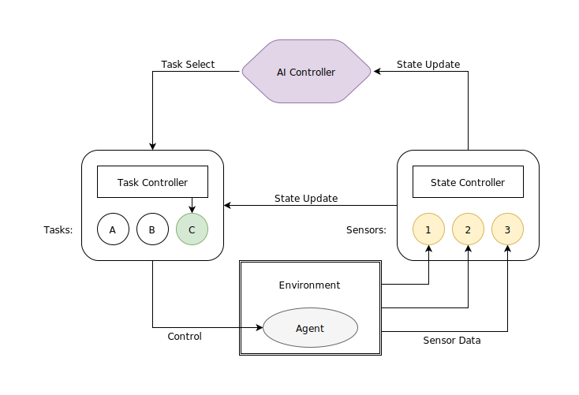

# RoombaSim

The goal of this project is to provide a high-level AI training environment for IARC Mission 7 ("herding roombas").


The simulator follows the following principles:

* *decoupled graphics* - the simulator supports a graphical viewer that can run in realtime, but all of that code is extracted into a separate class that is not necessary for simulation

* *time independent simulation* - simulations can run much faster than realtime at the same level of accuracy (this is important for reinforcement learning where many thousands of rounds need to be simulated during the training phase)

* *highly configurable parameters* - important constants are defined in `config.py` and can be redefined before simulation to change the behavior

## Requirements

The simulator is written entirely in python and requires the following python libraries:
* numpy
* pyglet

# Overview

The module structure is as follows:

* `roombasim` : utility functions and module-wide configuration
  * `roombasim.agent` : drone simulation code
  * `roombasim.ai` : ai, task, and state controllers
  * `roombasim.environment` : code to simulate the IARC 7 mission
  * `roombasim.graphics` : (optional) code to display a round in realtime
  * `roombasim.<team>` : team-specific submodule
    * `roombasim.<team>.ai` : custom AI controllers
    * `roombasim.<team>.state` : custom state detectors
    * `roombasim.<team>.task` : custom tasks

The high level control structure uses three main class types:

* `roombasim.ai.Controller` : Base class for a high level AI controller that takes current state inputs and chooses which tasks to perform.
* `roombasim.ai.Task` : Base class for a generic task that receives state information and issues high level motion commands.
* `roombasim.ai.State` : Base class for a "sensor" that can compute (optionally noisy) sensor data from the environment.

The following diagram shows the general flow of information through the system:



# Running

You can run a specific controller with the command line interface:

```bash
$ ./roombasim-cli.py run [config] [controller]
```

For instance, to load the `roombasim.pittras` configuration and run the `WaypointDemoController`, you can use the following command:

```bash
$ ./roombasim-cli.py run roombasim.pittras.config roombasim.pittras.ai.WaypointDemoController
```

This command will use default settings and create a window to preview the controller in real time.

# Human Player

To send actions to the drone manually, you can use the `human_player` script:

```bash
$ ./roombasim-cli.py human_player
```

Click anywhere to move the drone there, left click on a roomba to land on top, and right click to block.

# Demo

There are also a few demo controllers that can be run using different commands.

## Roomba demo:

```bash
$ ./roombasim-cli.py demo {params}

Optional params:
    -num_targets
    -num_obstacles
    -target_spawn_radius
    -obstacle_spawn_radius
    -timescale
```

For example:

```bash
# default args
$ ./roombasim-cli.py demo

# custom args
$ ./roombasim-cli.py demo -num_targets=4 -num_obstacles=2 -target_spawn_radius=0.5 -obstacle_spawn_radius=2
```

## Keyboard demo:

To experiment with drone movement and controls, you can run the keyboard demo which simulates manual control in a form of attitude mode.

*(This is really hard to control)*

```bash
$ ./roombasim-cli.py keydemo
```

Controls:

* `K` : pitch up
* `I` : pitch down
* `J` : roll left
* `L` : roll right
* `A` : yaw left
* `D` : yaw right
* `W` : throttle up
* `S` : throttle down
