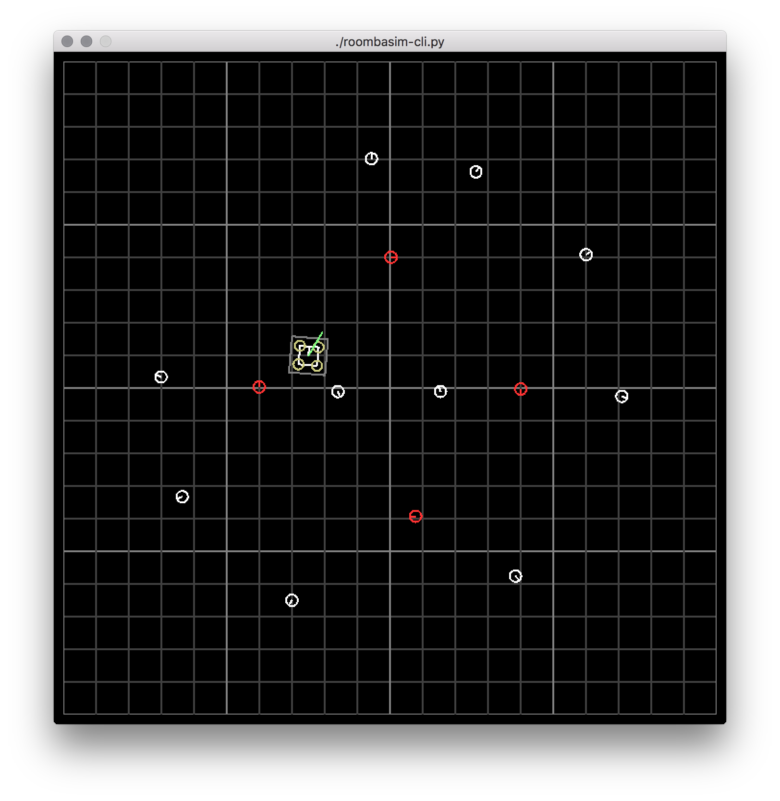

# RoombaSim

The goal of this project is to provide a high-level AI training environment for IARC Mission 7 ("herding roombas").



The simulator follows the following principles:

* *decoupled graphics* - the simulator supports a graphical viewer that can run in realtime, but all of that code is extracted into a separate class that is not necessary for simulation

* *time independent simulation* - simulations can run much faster than realtime at the same level of accuracy (this is important for reinforcement learning where many thousands of rounds need to be simulated during the training phase)

* *highly configurable parameters* - important constants are defined in `config.py` and can be redefined before simulation to change the behavior

## Requirements

The simulator is written entirely in python and requires the following python libraries:
* numpy
* pyglet

## Running the demo

You can run a simple roomba movement demo using the CLI:

```bash
$ python roombasim.py demo {params}

Optional params:
    -num_targets
    -num_obstacles
    -target_spawn_radius
    -obstacle_spawn_radius
```

For example:

```bash
# default args
$ python roombasim.py demo

# custom args
$ python roombasim.py demo -num_targets=4 -num_obstacles=2 -target_spawn_radius=0.5 -obstacle_spawn_radius=2
```